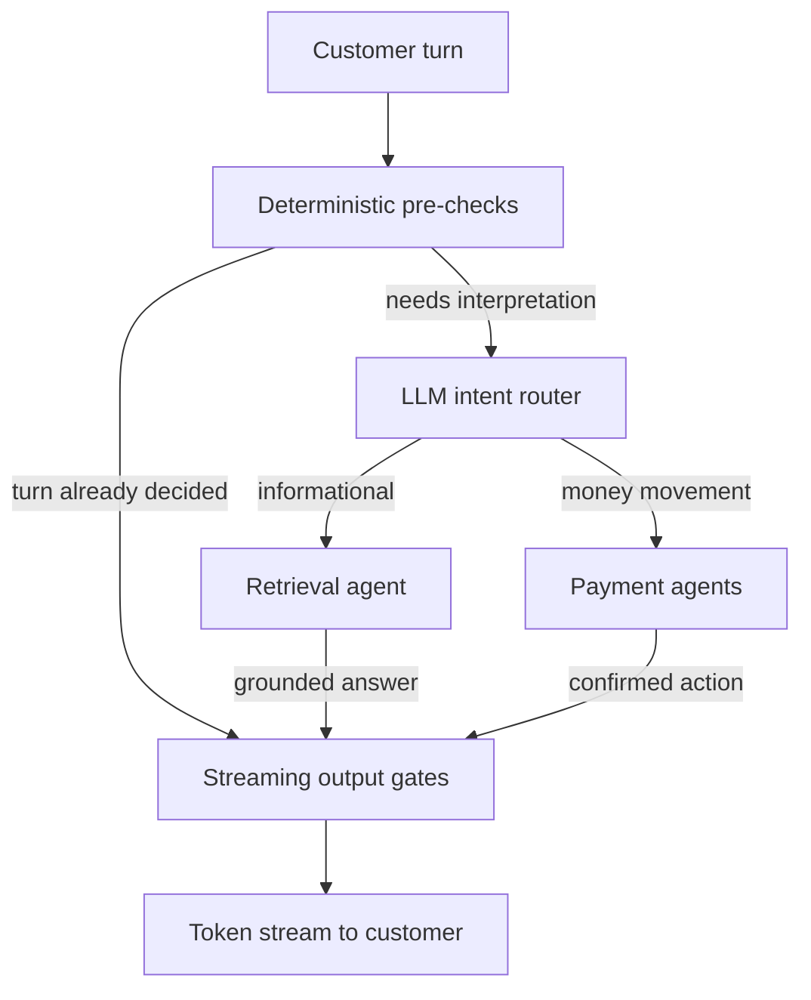

Every bank has a chatbot. They answer questions about branch hours and card fees, and if
you ask one to send money it gives you a link to the app.

This one sends the money.

I think that is why nobody in the market had built it yet. When an assistant answers a
question wrong, someone is annoyed. When it carries out a transfer wrong, a customer's
money has gone to the wrong person and nobody can take it back. Those are not the same
problem, and the second one decided almost every choice I made.

<dl class="facts">

<dt>status</dt><dd>Live bank-wide, serving 100+ customers a day</dd>

<dt>built</dt><dd>Roughly four months, starting from nothing</dd>

<dt>languages</dt><dd>Arabic and English, switchable mid-conversation</dd>

<dt>my scope</dt><dd>Architecture through production</dd>

</dl>

## What it does

Customers ask about products and policies and get an answer taken from the bank's own
documentation. They can also move money four different ways: to a mobile number, to an
account at another bank, to another customer inside the bank, or between their own
accounts. All of it works in Arabic and English, and people switch between the two
mid-sentence without warning.

There was nothing here before. No older chatbot to extend, no phone menu to replace. The
bank went from having no assistant at all to one that can move customer money, in about
four months.

## The rule I built everything around

**The model works out what someone wants. It never authorizes anything.** Every step with
real consequences runs in ordinary code that the model can trigger but cannot talk its way
past.

Take *send 50 to Ahmed*. It sounds like an instruction. It is really four open questions,
and I only trusted the model to ask them.

resolved explicitly before anything executes

<ol>
<li><strong>Which Ahmed?</strong> A saved recipient, or a name matching nobody.</li>
<li><strong>From which account?</strong> The customer may hold several.</li>
<li><strong>Over which rail?</strong> Four routes, four sets of validation rules.</li>
<li><strong>Did they mean it?</strong> Nothing runs without an explicit yes.</li>
</ol>

I built each of the four transfer types as its own **LangGraph** agent, running on **Azure
OpenAI**'s GPT-4.1, instead of handing one agent every tool with a long prompt explaining
when to use which. A prompt that tries to cover all four
covers none of them properly, and I did not want a bug in one payment route to be able to
reach another.

I also stopped treating what the customer says as evidence. Account numbers get tokenised
by the backend and echoed back by the app, so before the server accepts a selection it
reloads what each payment agent was actually waiting on and checks that the chosen account
was in the list it offered. If it was not, the system treats it as a typo and shows the
list again. Returning an error there would just end the conversation, and the customer is
halfway through sending money.

<!-- Diagram source. Edit this, run `npm run diagrams`, and the SVG below
     is regenerated. Rendered at author time, not build time, so CI needs
     no browser.

-->

<svg id="mermaid-0" width="100%" xmlns="http://www.w3.org/2000/svg" xmlns:xlink="http://www.w3.org/1999/xlink" class="flowchart" style="max-width: 618.8125px;" viewBox="0 0 618.8125 626" role="graphics-document document" aria-roledescription="flowchart-v2"><g><marker id="mermaid-0_flowchart-v2-pointEnd" class="marker flowchart-v2" viewBox="0 0 10 10" refX="5" refY="5" markerUnits="userSpaceOnUse" markerWidth="8" markerHeight="8" orient="auto"><path d="M 0 0 L 10 5 L 0 10 z" class="arrowMarkerPath" style="stroke-width: 1; stroke-dasharray: 1, 0;"></path></marker><marker id="mermaid-0_flowchart-v2-pointStart" class="marker flowchart-v2" viewBox="0 0 10 10" refX="4.5" refY="5" markerUnits="userSpaceOnUse" markerWidth="8" markerHeight="8" orient="auto"><path d="M 0 5 L 10 10 L 10 0 z" class="arrowMarkerPath" style="stroke-width: 1; stroke-dasharray: 1, 0;"></path></marker><marker id="mermaid-0_flowchart-v2-pointEnd-margin" class="marker flowchart-v2" viewBox="0 0 11.5 14" refX="11.5" refY="7" markerUnits="userSpaceOnUse" markerWidth="10.5" markerHeight="14" orient="auto"><path d="M 0 0 L 11.5 7 L 0 14 z" class="arrowMarkerPath" style="stroke-width: 0; stroke-dasharray: 1, 0;"></path></marker><marker id="mermaid-0_flowchart-v2-pointStart-margin" class="marker flowchart-v2" viewBox="0 0 11.5 14" refX="1" refY="7" markerUnits="userSpaceOnUse" markerWidth="11.5" markerHeight="14" orient="auto"><polygon points="0,7 11.5,14 11.5,0" class="arrowMarkerPath" style="stroke-width: 0; stroke-dasharray: 1, 0;"></polygon></marker><marker id="mermaid-0_flowchart-v2-circleEnd" class="marker flowchart-v2" viewBox="0 0 10 10" refX="11" refY="5" markerUnits="userSpaceOnUse" markerWidth="11" markerHeight="11" orient="auto"><circle cx="5" cy="5" r="5" class="arrowMarkerPath" style="stroke-width: 1; stroke-dasharray: 1, 0;"></circle></marker><marker id="mermaid-0_flowchart-v2-circleStart" class="marker flowchart-v2" viewBox="0 0 10 10" refX="-1" refY="5" markerUnits="userSpaceOnUse" markerWidth="11" markerHeight="11" orient="auto"><circle cx="5" cy="5" r="5" class="arrowMarkerPath" style="stroke-width: 1; stroke-dasharray: 1, 0;"></circle></marker><marker id="mermaid-0_flowchart-v2-circleEnd-margin" class="marker flowchart-v2" viewBox="0 0 10 10" refY="5" refX="12.25" markerUnits="userSpaceOnUse" markerWidth="14" markerHeight="14" orient="auto"><circle cx="5" cy="5" r="5" class="arrowMarkerPath" style="stroke-width: 0; stroke-dasharray: 1, 0;"></circle></marker><marker id="mermaid-0_flowchart-v2-circleStart-margin" class="marker flowchart-v2" viewBox="0 0 10 10" refX="-2" refY="5" markerUnits="userSpaceOnUse" markerWidth="14" markerHeight="14" orient="auto"><circle cx="5" cy="5" r="5" class="arrowMarkerPath" style="stroke-width: 0; stroke-dasharray: 1, 0;"></circle></marker><marker id="mermaid-0_flowchart-v2-crossEnd" class="marker cross flowchart-v2" viewBox="0 0 11 11" refX="12" refY="5.2" markerUnits="userSpaceOnUse" markerWidth="11" markerHeight="11" orient="auto"><path d="M 1,1 l 9,9 M 10,1 l -9,9" class="arrowMarkerPath" style="stroke-width: 2; stroke-dasharray: 1, 0;"></path></marker><marker id="mermaid-0_flowchart-v2-crossStart" class="marker cross flowchart-v2" viewBox="0 0 11 11" refX="-1" refY="5.2" markerUnits="userSpaceOnUse" markerWidth="11" markerHeight="11" orient="auto"><path d="M 1,1 l 9,9 M 10,1 l -9,9" class="arrowMarkerPath" style="stroke-width: 2; stroke-dasharray: 1, 0;"></path></marker><marker id="mermaid-0_flowchart-v2-crossEnd-margin" class="marker cross flowchart-v2" viewBox="0 0 15 15" refX="17.7" refY="7.5" markerUnits="userSpaceOnUse" markerWidth="12" markerHeight="12" orient="auto"><path d="M 1,1 L 14,14 M 1,14 L 14,1" class="arrowMarkerPath" style="stroke-width: 2.5;"></path></marker><marker id="mermaid-0_flowchart-v2-crossStart-margin" class="marker cross flowchart-v2" viewBox="0 0 15 15" refX="-3.5" refY="7.5" markerUnits="userSpaceOnUse" markerWidth="12" markerHeight="12" orient="auto"><path d="M 1,1 L 14,14 M 1,14 L 14,1" class="arrowMarkerPath" style="stroke-width: 2.5; stroke-dasharray: 1, 0;"></path></marker><g class="root"><g class="clusters"></g><g class="edgePaths"><path d="M311.805,56L311.805,60.167C311.805,64.333,311.805,72.667,311.805,80.333C311.805,88,311.805,95,311.805,98.5L311.805,102" id="mermaid-0-L_U_G_0" class="edge-thickness-normal edge-pattern-solid edge-thickness-normal edge-pattern-solid flowchart-link" style=";" data-edge="true" data-et="edge" data-id="L_U_G_0" data-points="W3sieCI6MzExLjgwNDY4NzUsInkiOjU2fSx7IngiOjMxMS44MDQ2ODc1LCJ5Ijo4MX0seyJ4IjozMTEuODA0Njg3NSwieSI6MTA2fV0=" data-look="classic" marker-end="url(#mermaid-0_flowchart-v2-pointEnd)"></path><path d="M230.045,154L209.038,160.167C188.03,166.333,146.015,178.667,125.008,195C104,211.333,104,231.667,104,252C104,272.333,104,292.667,104,313C104,333.333,104,353.667,104,374C104,394.333,104,414.667,121.405,430.784C138.81,446.902,173.619,458.804,191.024,464.755L208.429,470.706" id="mermaid-0-L_G_S_0" class="edge-thickness-normal edge-pattern-solid edge-thickness-normal edge-pattern-solid flowchart-link" style=";" data-edge="true" data-et="edge" data-id="L_G_S_0" data-points="W3sieCI6MjMwLjA0NTQ2NjE4ODUyNDU5LCJ5IjoxNTR9LHsieCI6MTA0LCJ5IjoxOTF9LHsieCI6MTA0LCJ5IjoyNTJ9LHsieCI6MTA0LCJ5IjozMTN9LHsieCI6MTA0LCJ5IjozNzR9LHsieCI6MTA0LCJ5Ijo0MzV9LHsieCI6MjEyLjIxMzYyNzA0OTE4MDMzLCJ5Ijo0NzJ9XQ==" data-look="classic" marker-end="url(#mermaid-0_flowchart-v2-pointEnd)"></path><path d="M346.901,154L355.919,160.167C364.937,166.333,382.972,178.667,391.99,190.333C401.008,202,401.008,213,401.008,218.5L401.008,224" id="mermaid-0-L_G_R_0" class="edge-thickness-normal edge-pattern-solid edge-thickness-normal edge-pattern-solid flowchart-link" style=";" data-edge="true" data-et="edge" data-id="L_G_R_0" data-points="W3sieCI6MzQ2LjkwMDk5ODk3NTQwOTgzLCJ5IjoxNTR9LHsieCI6NDAxLjAwNzgxMjUsInkiOjE5MX0seyJ4Ijo0MDEuMDA3ODEyNSwieSI6MjI4fV0=" data-look="classic" marker-end="url(#mermaid-0_flowchart-v2-pointEnd)"></path><path d="M354.345,276L342.355,282.167C330.365,288.333,306.386,300.667,294.396,312.333C282.406,324,282.406,335,282.406,340.5L282.406,346" id="mermaid-0-L_R_K_0" class="edge-thickness-normal edge-pattern-solid edge-thickness-normal edge-pattern-solid flowchart-link" style=";" data-edge="true" data-et="edge" data-id="L_R_K_0" data-points="W3sieCI6MzU0LjM0NDkwMjY2MzkzNDQsInkiOjI3Nn0seyJ4IjoyODIuNDA2MjUsInkiOjMxM30seyJ4IjoyODIuNDA2MjUsInkiOjM1MH1d" data-look="classic" marker-end="url(#mermaid-0_flowchart-v2-pointEnd)"></path><path d="M447.671,276L459.66,282.167C471.65,288.333,495.63,300.667,507.62,312.333C519.609,324,519.609,335,519.609,340.5L519.609,346" id="mermaid-0-L_R_P_0" class="edge-thickness-normal edge-pattern-solid edge-thickness-normal edge-pattern-solid flowchart-link" style=";" data-edge="true" data-et="edge" data-id="L_R_P_0" data-points="W3sieCI6NDQ3LjY3MDcyMjMzNjA2NTYsInkiOjI3Nn0seyJ4Ijo1MTkuNjA5Mzc1LCJ5IjozMTN9LHsieCI6NTE5LjYwOTM3NSwieSI6MzUwfV0=" data-look="classic" marker-end="url(#mermaid-0_flowchart-v2-pointEnd)"></path><path d="M282.406,398L282.406,404.167C282.406,410.333,282.406,422.667,282.406,434.333C282.406,446,282.406,457,282.406,462.5L282.406,468" id="mermaid-0-L_K_S_0" class="edge-thickness-normal edge-pattern-solid edge-thickness-normal edge-pattern-solid flowchart-link" style=";" data-edge="true" data-et="edge" data-id="L_K_S_0" data-points="W3sieCI6MjgyLjQwNjI1LCJ5IjozOTh9LHsieCI6MjgyLjQwNjI1LCJ5Ijo0MzV9LHsieCI6MjgyLjQwNjI1LCJ5Ijo0NzJ9XQ==" data-look="classic" marker-end="url(#mermaid-0_flowchart-v2-pointEnd)"></path><path d="M519.609,398L519.609,404.167C519.609,410.333,519.609,422.667,496.275,434.834C472.942,447.001,426.274,459.003,402.94,465.003L379.606,471.004" id="mermaid-0-L_P_S_0" class="edge-thickness-normal edge-pattern-solid edge-thickness-normal edge-pattern-solid flowchart-link" style=";" data-edge="true" data-et="edge" data-id="L_P_S_0" data-points="W3sieCI6NTE5LjYwOTM3NSwieSI6Mzk4fSx7IngiOjUxOS42MDkzNzUsInkiOjQzNX0seyJ4IjozNzUuNzMyMDY5NjcyMTMxMTYsInkiOjQ3Mn1d" data-look="classic" marker-end="url(#mermaid-0_flowchart-v2-pointEnd)"></path><path d="M282.406,520L282.406,524.167C282.406,528.333,282.406,536.667,282.406,544.333C282.406,552,282.406,559,282.406,562.5L282.406,566" id="mermaid-0-L_S_OUT_0" class="edge-thickness-normal edge-pattern-solid edge-thickness-normal edge-pattern-solid flowchart-link" style=";" data-edge="true" data-et="edge" data-id="L_S_OUT_0" data-points="W3sieCI6MjgyLjQwNjI1LCJ5Ijo1MjB9LHsieCI6MjgyLjQwNjI1LCJ5Ijo1NDV9LHsieCI6MjgyLjQwNjI1LCJ5Ijo1NzB9XQ==" data-look="classic" marker-end="url(#mermaid-0_flowchart-v2-pointEnd)"></path></g><g class="edgeLabels"><g class="edgeLabel"><g class="label" data-id="L_U_G_0" transform="translate(0, 0)"><foreignObject width="0" height="0">

</foreignObject></g></g><g class="edgeLabel" transform="translate(104, 313)"><g class="label" data-id="L_G_S_0" transform="translate(-96, -12)"><foreignObject width="192" height="24">

turn already decided

</foreignObject></g></g><g class="edgeLabel" transform="translate(401.0078125, 191)"><g class="label" data-id="L_G_R_0" transform="translate(-96, -12)"><foreignObject width="192" height="24">

needs interpretation

</foreignObject></g></g><g class="edgeLabel" transform="translate(282.40625, 313)"><g class="label" data-id="L_R_K_0" transform="translate(-62.40625, -12)"><foreignObject width="124.8125" height="24">

informational

</foreignObject></g></g><g class="edgeLabel" transform="translate(519.609375, 313)"><g class="label" data-id="L_R_P_0" transform="translate(-67.203125, -12)"><foreignObject width="134.40625" height="24">

money movement

</foreignObject></g></g><g class="edgeLabel" transform="translate(282.40625, 435)"><g class="label" data-id="L_K_S_0" transform="translate(-72, -12)"><foreignObject width="144" height="24">

grounded answer

</foreignObject></g></g><g class="edgeLabel" transform="translate(519.609375, 435)"><g class="label" data-id="L_P_S_0" transform="translate(-76.8046875, -12)"><foreignObject width="153.609375" height="24">

confirmed action

</foreignObject></g></g><g class="edgeLabel"><g class="label" data-id="L_S_OUT_0" transform="translate(0, 0)"><foreignObject width="0" height="0">

</foreignObject></g></g></g><g class="nodes"><g class="node default" id="mermaid-0-flowchart-U-0" data-look="classic" transform="translate(311.8046875, 32)"><rect class="basic label-container" style="" x="-86.40625" y="-24" width="172.8125" height="48"></rect><g class="label" style="" transform="translate(-62.40625, -12)"><rect></rect><foreignObject width="124.8125" height="24">

Customer turn

</foreignObject></g></g><g class="node default" id="mermaid-0-flowchart-G-1" data-look="classic" transform="translate(311.8046875, 130)"><rect class="basic label-container" style="" x="-139.203125" y="-24" width="278.40625" height="48"></rect><g class="label" style="" transform="translate(-115.203125, -12)"><rect></rect><foreignObject width="230.40625" height="24">

Deterministic pre-checks

</foreignObject></g></g><g class="node default" id="mermaid-0-flowchart-S-3" data-look="classic" transform="translate(282.40625, 496)"><rect class="basic label-container" style="" x="-129.6015625" y="-24" width="259.203125" height="48"></rect><g class="label" style="" transform="translate(-105.6015625, -12)"><rect></rect><foreignObject width="211.203125" height="24">

Streaming output gates

</foreignObject></g></g><g class="node default" id="mermaid-0-flowchart-R-5" data-look="classic" transform="translate(401.0078125, 252)"><rect class="basic label-container" style="" x="-105.6015625" y="-24" width="211.203125" height="48"></rect><g class="label" style="" transform="translate(-81.6015625, -12)"><rect></rect><foreignObject width="163.203125" height="24">

LLM intent router

</foreignObject></g></g><g class="node default" id="mermaid-0-flowchart-K-7" data-look="classic" transform="translate(282.40625, 374)"><rect class="basic label-container" style="" x="-96" y="-24" width="192" height="48"></rect><g class="label" style="" transform="translate(-72, -12)"><rect></rect><foreignObject width="144" height="24">

Retrieval agent

</foreignObject></g></g><g class="node default" id="mermaid-0-flowchart-P-9" data-look="classic" transform="translate(519.609375, 374)"><rect class="basic label-container" style="" x="-91.203125" y="-24" width="182.40625" height="48"></rect><g class="label" style="" transform="translate(-67.203125, -12)"><rect></rect><foreignObject width="134.40625" height="24">

Payment agents

</foreignObject></g></g><g class="node default" id="mermaid-0-flowchart-OUT-15" data-look="classic" transform="translate(282.40625, 594)"><rect class="basic label-container" style="" x="-139.203125" y="-24" width="278.40625" height="48"></rect><g class="label" style="" transform="translate(-115.203125, -12)"><rect></rect><foreignObject width="230.40625" height="24">

Token stream to customer

</foreignObject></g></g></g></g></g><defs><filter id="mermaid-0-drop-shadow" height="130%" width="130%"><feDropShadow dx="4" dy="4" stdDeviation="0" flood-opacity="0.06" flood-color="#000000"></feDropShadow></filter></defs><defs><filter id="mermaid-0-drop-shadow-small" height="150%" width="150%"><feDropShadow dx="2" dy="2" stdDeviation="0" flood-opacity="0.06" flood-color="#000000"></feDropShadow></filter></defs><linearGradient id="mermaid-0-gradient" gradientUnits="objectBoundingBox" x1="0%" y1="0%" x2="100%" y2="0%"><stop offset="0%" stop-color="#3f3f46" stop-opacity="1"></stop><stop offset="100%" stop-color="hsl(240, 0%, 0%)" stop-opacity="1"></stop></linearGradient></svg>

## Earning the right to go live

**A bank does not approve something like this because the demo went well.** Most of those
four months went on showing that it fails safely, over and over, on demand. That meant
security review and repeated rounds of testing with the client, and every round turned up a
category of failure I had to close before we could move on.

All of it came down to one question. What does it do when somebody pushes on it? Here is
the behaviour I ended up guaranteeing, next to what each case did before I guarded it.

<table>
<thead><tr><th>input</th><th>without guards</th><th>what ships</th></tr></thead>
<tbody>
<tr>
  <td>send 50 to Ahmed</td>
  <td class="naive">Picks one of three saved recipients and carries on</td>
  <td>Asks which one. Nothing runs without an explicit yes.</td>
</tr>
<tr>
  <td>selects an account never offered</td>
  <td class="naive">Taken at face value and acted on</td>
  <td>Server checks it against the list it actually offered, shows the list again, counts the retry.</td>
</tr>
<tr>
  <td>okay thanks stop</td>
  <td class="naive">Ends the chat in Arabic, answers <em>"How can I assist you further?"</em> in English</td>
  <td>Matched against a list of closing phrases, identically in both languages, before routing.</td>
</tr>
<tr>
  <td>stop the sms alerts</td>
  <td class="naive">A search for the word "stop" hangs up on a customer asking for help</td>
  <td>Not a closing phrase. Handled as an ordinary request.</td>
</tr>
<tr>
  <td>cards as a rust script</td>
  <td class="naive">Returns a working Rust program printing real card fees</td>
  <td>Caught on the way out, before it reaches the screen.</td>
</tr>
</tbody>
</table>

**Two things make that behaviour possible, and neither one is a prompt.**

The first is that answers get checked while they are being written rather than after. Three
gates sit on the text as it streams out, each holding back only the characters that could
still turn into something the assistant should not send. Checking a finished answer is
pointless, because the customer has already read it. This is what stops the assistant
writing code, or formatting, or anything else that is factually correct and still wrong for
a bank to put in front of someone.

The second is a terminology layer. It is an Islamic bank, so it offers financing and never
lending, and a model translating into English will reach for "loan" every time. The rule
rewrites it, with two exceptions I left in on purpose. One is a product name the board
approved. The other is the phrase for the thing the Sharia board actually prohibits, where
swapping in "financing" would suggest the bank offers it.

Both run on every response, in both languages, and releases are gated on 458 regression
tests plus a set of adversarial probes that run against every guardrail.

## Fast enough that nobody doubts it worked

**Answers appear word by word as they are written.** The service is **FastAPI**, streaming
over SSE, because if someone is waiting to hear that their money moved then a screen sitting
still reads as a failed transfer.

The embedding model produces vectors too large for **pgvector** to index, so every search
reads the whole **PostgreSQL** table. Search is the expensive part here and it only gets worse as the
document set grows, which is why I spent most of the effort on not searching. A location
shortcut, a greeting matcher, a direct match against common questions, then a per-session
**Redis** cache, and only after all that the full pipeline. When it does search, I left the
similarity thresholds deliberately loose and let a **Cohere** reranker sort out precision
afterwards.

## Knowing when it didn't work

**Every turn where the assistant gave no real answer is tagged in Langfuse with a reason.**
Retrieval found nothing, which is a content gap. Or it found something and the model still
declined, which is a precision problem. Or routing decided the question was not about
banking at all, which tells the bank what its customers keep asking for that it does not
offer.

One number would say the assistant failed six percent of the time. Three numbers say which
team should go and fix it.

The quality judge returns "unknown" when it errors, rather than "answered", so the figure
comes out as an undercount instead of a clean bill of health. I would rather the number
looked slightly worse than it really is than the other way round.
