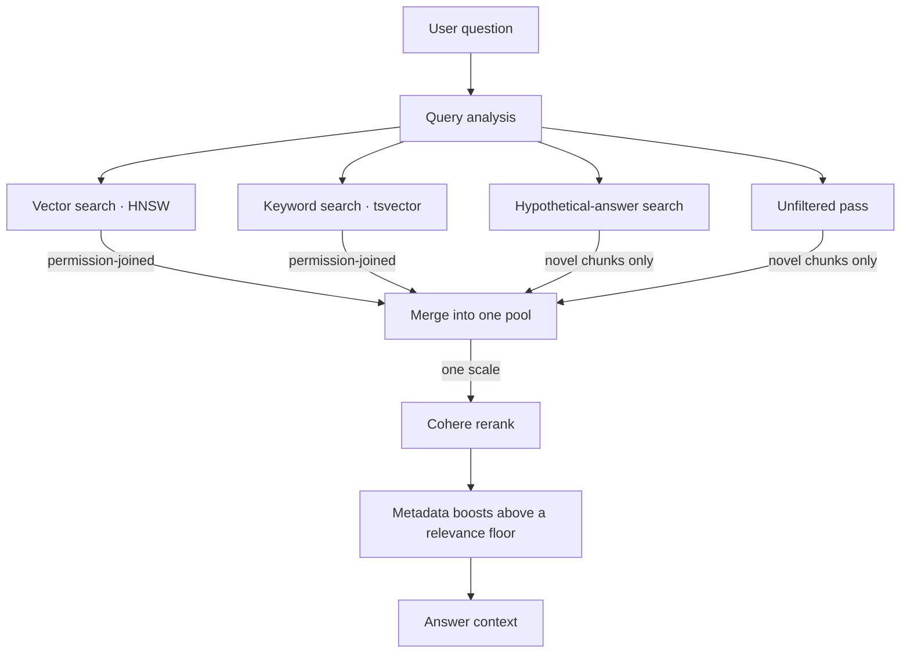

A multinational telecom group, with an operating company in each of its markets. Every one
of them had spent a decade building its own SharePoint estate. Roughly ten thousand
documents between them: policies, product documentation, commercial terms, internal
procedures, written by different teams in different years to different templates, in more
than one language.

Finding a number meant opening each company's SharePoint in turn and reading through
documents until you found the figure you wanted, then doing the same again for the next
market, in a spreadsheet, by hand.

You cannot fix that by pointing a chatbot at the drives. A lot of the value sits in
documents most staff are not cleared to read, and an assistant that shows someone a file
they are not entitled to see has not given a bad answer. It has caused a data breach.

<dl class="facts">

<dt>adoption</dt><dd>In production, adopted by multiple teams across the group</dd>

<dt>corpus</dt><dd>~10,000 legacy documents across every operating company</dd>

<dt>built</dt><dd>Three to four months</dd>

<dt>my scope</dt><dd>Retrieval through ingestion, end to end</dd>

</dl>

## What it does

**Staff ask a question in plain language and get an answer from their own company's
documents, and from other companies' documents where they are entitled to see them, so
figures and policies can be compared across markets.** It works across the languages the
corpus happens to be written in, because the corpus is not consistent about that either.

It also finishes the job. Ask for a comparison and you get the chart or the spreadsheet,
not a paragraph describing one.

People reach it through a forked **OpenWebUI** front end, so it turned up looking like
something they already knew rather than another internal portal to learn. Behind that sits
a **FastAPI** service over a **LangGraph** flow, with a separate **Celery** pipeline on
**Redis Streams** keeping the index current.

## Permissions are part of the search, not a filter on top

**I work out who can see what when a document is ingested, not when somebody asks.**
Permissions come from **Microsoft Graph** and get flattened into one row per person per
document. Every search then joins against that table, so anything you are not entitled to
never enters the running. It is not fetched and then hidden. It is never fetched, which
also means it cannot leak out through a summary.

Getting there took more work than the design makes it sound. SharePoint site groups have
no Graph endpoint at all, so I expand them through the SharePoint REST API under
certificate authentication and resolve each login back to an object ID. An all staff group
did that thousands of times at once, tripped rate limiting and stalled the whole job, so
the expansion is bounded now.

The one that worried me more only showed up on the second ingest. Rebuilding the access
table from SharePoint quietly revoked every grant that had not originally come from
SharePoint, so people silently lost access they were supposed to have. I now take a
snapshot of who holds access before the rebuild and add them back afterwards.

## A corpus where every filter starves a different question

**The hard part was never the model. It was that no single way of narrowing a search works
for every question.**

Someone asks for last year's actuals for one particular market. A dozen documents could
plausibly answer. One of them is the audited year end report. The rest are forecasts,
trackers, and a strategy deck quoting the same figures from two years earlier. To a search
engine they look almost identical.

The obvious move is to filter by country and reporting period. That breaks straight away,
because plenty of relevant documents only mention their country in the body text, never in
the filename or the folder, so a filtered search comes back with nothing at all. Every
filter that rescues one question starves another, and you cannot tell in advance which kind
of question you are dealing with.

I went through four versions before I had something that held up.

<table>
<thead><tr><th>approach</th><th>what happened</th></tr></thead>
<tbody>
<tr><td>Hard filters</td><td class="naive">Country and department in the <code>WHERE</code> clause. Dropped documents whose country appeared only in the text, and broke every question that crossed departments.</td></tr>
<tr><td>Multiplicative boosts</td><td class="naive">Metadata signals stacked up to roughly 2.5×, so a 0.4 match could outrank a 0.9 one. Ranking became impossible to reason about.</td></tr>
<tr><td>Additive boosts</td><td class="naive">Bounded and readable, capped at +0.53, but still lifted documents that merely mentioned the right country above the one that actually answered.</td></tr>
<tr><td>Additive, above a floor</td><td>Boosts only apply once a document is already relevant, so they reorder good candidates instead of dragging up bad ones. Signals taken from the text itself stay ungated. <strong>Shipped.</strong></td></tr>
</tbody>
</table>

Underneath all of that I keep a safety net. The top few documents by raw similarity always
hold their place in the final answer, pulled back in if the boosting pushed them out.
Without it the system would confidently report that it could not find documents which had
ranked first before any of the reweighting touched them.

All of it sits in **PostgreSQL** with **pgvector**, and rather than bet on one search, I run
four at once. A hypothetical answer embedding helps on prose and drifts badly on tables.
Keyword search catches exact terminology and misses paraphrase. An unfiltered pass rescues
whatever the scoping dropped. Everything merges before a single **Cohere** rerank, so it is
all scored on one scale and a rescued document competes fairly against the rest.

## Keeping the index current

**Nobody updates any of this by hand.** A scheduled poller watches each company's SharePoint
for new and changed documents and queues them onto Celery for re-ingestion, so the index
follows the corpus on its own. That is also why the permissions bug above mattered as much
as it did. Re-ingestion is not a one off migration. It runs continuously, on **Azure
Kubernetes Service**, scaling out when the load calls for it.

The pipeline reads every page of every document with a vision model, which is slow, and
slow work breaks assumptions everywhere else. Most of what I had to fix came from that:
tasks getting killed before they finished and then requeueing forever, database connections
dropped while a document was still being read, one oversized PDF able to take a worker down
with it. None of it is interesting on its own. Together it is the difference between a
pipeline that demos and one that runs without anybody watching it.

## Answering isn't finishing

**The question people actually had was rarely "what does the policy say". It was "get me
these figures, for these markets, in something I can send on".**

The old way of working ended in a spreadsheet, so this ends in one too. On top of retrieval
it calls tools that run calculations and filtering over spreadsheet data, and it produces
PDF, Word and Excel files inside the conversation with charts rendered into them.

That is what turned it from a better search box into something teams actually adopted.
Retrieval replaced the reading. Generating the file replaced the afternoon that came after
it.
